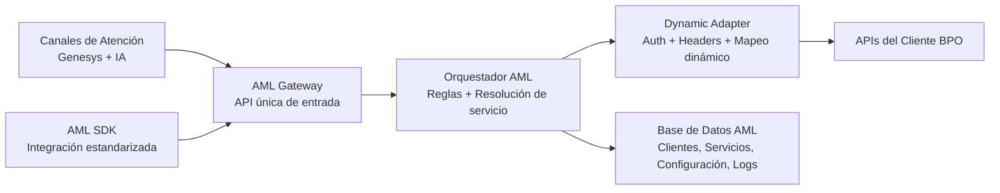

# AML Architecture — Executive View (1 slide)

## Mensaje ejecutivo (para explicar en 30 segundos)

- AML centraliza la integración entre canales (Genesys/IA) y sistemas del cliente.
- El Orquestador decide qué servicio ejecutar según cliente + intención.
- El Dynamic Adapter evita desarrollos por cliente al operar por configuración.
- La base de datos guarda configuración y trazabilidad completa.
- El SDK permite que otros equipos consuman AML con un contrato estándar.

## Beneficio de negocio

- Menor tiempo de onboarding de clientes.
- Menor costo de mantenimiento por integraciones custom.
- Mayor escalabilidad y control operativo.
