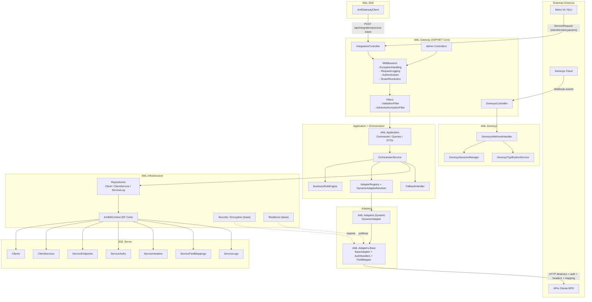

# AML Architecture Diagram

## Flujo resumido

1. IA o SDK invocan `IntegrationController` con intención y parámetros.
2. `OrchestratorService` consulta configuración activa en BD.
3. `DynamicAdapter` aplica autenticación, headers y mappings.
4. Se invoca API del cliente BPO y se normaliza la respuesta.
5. Se registra trazabilidad en `ServiceLogs` y se retorna respuesta estándar.
