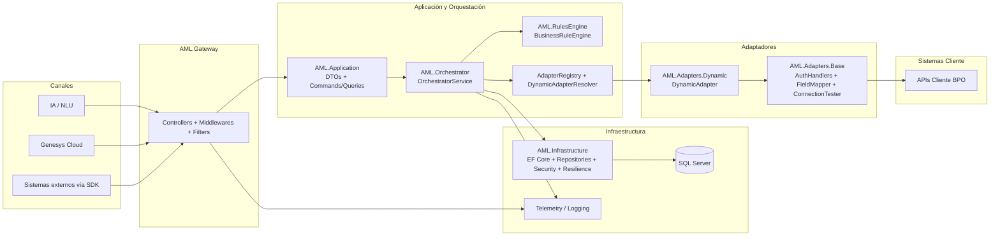

# Arquitectura de Alto Nivel — AML

## Objetivo

Habilitar integraciones multi-cliente entre canales de atención (Genesys/IA) y APIs externas de clientes BPO, con un modelo escalable basado en configuración.

---

## Vista de componentes (alto nivel)

---

## Responsabilidad por capa

- **Gateway:** punto único de entrada HTTP; aplica validaciones transversales (middlewares/filtros).
- **Application/Orchestrator:** resuelve intención + cliente, ejecuta reglas y selecciona adaptador.
- **Adapters:** construyen y ejecutan la llamada HTTP externa con auth, headers y mapping.
- **Infrastructure:** persistencia, repositorios, seguridad técnica, resiliencia y telemetría.

---

## Flujo funcional resumido

1. Llega solicitud con `clientId`, `intent` y parámetros.
2. Orquestador busca configuración activa del servicio.
3. Motor de reglas valida precondiciones.
4. `DynamicAdapter` aplica configuración (auth/headers/mapeo) y llama API del cliente.
5. Se normaliza la respuesta al contrato AML.
6. Se persiste trazabilidad (logs/correlación) y se responde al consumidor.

---

## Principios de diseño

- **Separación de responsabilidades por capa.**
- **Configuración sobre customización por cliente.**
- **Observabilidad y trazabilidad desde el diseño.**
- **Evolución segura:** prototipos en `AML.Prototype`, consolidación productiva en `AML.Solution`.
