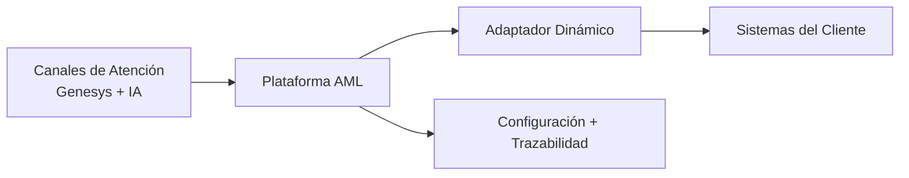

# Arquitectura Ultra Ejecutiva (1 Slide) — AML

## Título sugerido
`AML: integrar más clientes, más rápido y con control`

## Subtítulo sugerido
`Plataforma central + adaptador dinámico para reducir tiempo de onboarding y costo de integración.`

---

## Diagrama mínimo (comité directivo)

---

## Mensaje de negocio (3 bullets)

- **Velocidad:** nuevas integraciones por configuración, no por desarrollo a medida.
- **Control:** trazabilidad de extremo a extremo para operación y soporte.
- **Escalabilidad:** la misma plataforma habilita múltiples clientes BPO.

---

## Guion de 20 segundos

> “AML centraliza la integración entre canales de atención y sistemas del cliente.  
> Con el adaptador dinámico, configuramos integraciones en lugar de construirlas desde cero.  
> Esto reduce tiempos, baja costo operativo y mejora el control de punta a punta.”

---

## Pie de slide (opcional)

`Resultado esperado: menor time-to-market, menor costo por integración y mayor capacidad de crecimiento.`
