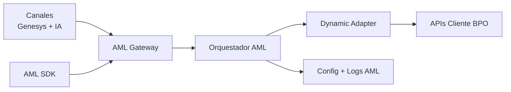

# Presentación Ejecutiva (3 Diapositivas) — AML

Documento listo para copiar/pegar en PowerPoint.

---

## Slide 1 — Problema de negocio y oportunidad

### Título
`Integraciones BPO: alto esfuerzo por cliente`

### Subtítulo
`Necesitamos pasar de integraciones “a medida” a integraciones “por configuración”.`

### Layout recomendado
- 2 columnas (60/40):
  - **Izquierda:** dolor actual + impacto.
  - **Derecha:** oportunidad con AML.

### Contenido (texto exacto)

#### Dolor actual
- Cada nuevo cliente exige desarrollos específicos.
- Time-to-market lento para habilitar nuevos servicios.
- Costos de mantenimiento crecen con cada variante.
- Menor trazabilidad operativa de punta a punta.

#### Impacto
- Mayor carga sobre equipos técnicos.
- Dependencia de backlog de desarrollo.
- Dificultad para escalar onboarding.

#### Oportunidad AML
- Integración multi-cliente basada en configuración.
- Contrato estándar entre IA, AML y APIs del cliente.
- Menor tiempo de salida y mayor escalabilidad.

### Mensaje de cierre del slide
`Objetivo: habilitar nuevos clientes con mínimo/no código.`

---

## Slide 2 — Arquitectura AML (vista ejecutiva)

### Título
`AML centraliza y orquesta la integración`

### Diagrama (pegar tal cual en Mermaid o recrear con SmartArt)

### Texto de apoyo (debajo del diagrama)
- **Gateway:** punto único de entrada.
- **Orquestador:** decide servicio por cliente + intención.
- **Dynamic Adapter:** aplica auth, headers y mappings dinámicos.
- **Base AML:** almacena configuración y trazabilidad.
- **SDK:** acelera consumo de AML desde otros equipos/sistemas.

### Mensaje de cierre del slide
`Valor diferencial: onboarding por configuración, no por desarrollo específico.`

---

## Slide 3 — Roadmap inmediato + KPIs

### Título
`Ejecución siguiente para ir a piloto productivo`

### Layout recomendado
- Parte superior: roadmap (3 bloques horizontales)
- Parte inferior: KPIs de negocio/operación

### Roadmap (texto exacto)

#### Fase 1 — Cierre funcional backend
- CRUD completo de Admin (clientes/servicios/headers/mappings)
- Seguridad JWT y manejo de secretos
- Hardening de reglas y validaciones

#### Fase 2 — Confiabilidad y calidad
- Pruebas unitarias + integración + smoke API
- Observabilidad (logs estructurados + métricas + tracing)
- Resiliencia (retry/circuit breaker) en llamadas externas

#### Fase 3 — Habilitación operativa
- Dashboard Angular (wizard de configuración)
- Piloto con cliente real
- Ajustes de performance y soporte operacional

### KPIs sugeridos (texto exacto)
- **Tiempo de onboarding cliente:** reducción frente a línea base actual.
- **% integraciones sin código adicional:** indicador de reutilización.
- **Tasa de éxito de invocaciones:** disponibilidad operativa.
- **Latencia p95 de integración:** desempeño de experiencia.
- **Tiempo de diagnóstico (por CorrelationId):** eficiencia de soporte.

### Mensaje de cierre del slide
`Resultado esperado: menor costo de integración, menor tiempo de habilitación y mayor escalabilidad del modelo BPO.`

---

## Guion de presentación (60-90 segundos total)

1. **Slide 1 (20-30s):**
   “Hoy integramos cliente por cliente con alto costo técnico. AML nace para convertir ese modelo en uno configurable y escalable.”
2. **Slide 2 (20-30s):**
   “La arquitectura centraliza entrada, orquesta por intención y ejecuta integración dinámica con trazabilidad completa.”
3. **Slide 3 (20-30s):**
   “El siguiente foco es cerrar capacidades productivas, medir con KPIs claros y movernos a piloto con evidencia de valor.”
