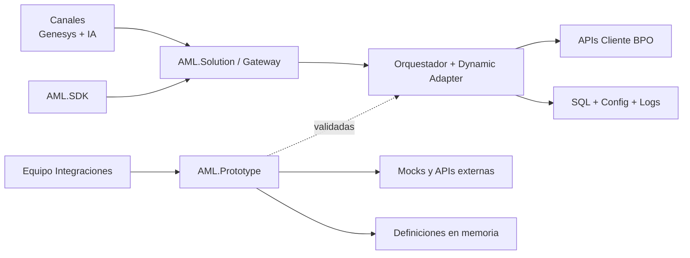

# Presentación Ejecutiva — AML Plataforma + Prototipo de Integraciones

## Slide 1 — Título

**AML: Plataforma Escalable + Prototipo Acelerador**  
Estrategia dual para avanzar rápido sin comprometer estabilidad

---

## Slide 2 — Situación y desafío

### Problema actual
- Cada cliente nuevo requiere adaptaciones técnicas específicas.
- El equipo principal se puede saturar entre construcción base y nuevas integraciones.
- Esto retrasa entregas y reduce velocidad de onboarding.

### Necesidad
- Mantener un **core robusto y estable**.
- Habilitar un espacio de **experimentación rápida** para integraciones.

---

## Slide 3 — Estrategia propuesta (dos carriles)

### Carril 1: `AML.Solution` (proyecto principal)
- Arquitectura modular de producción.
- Persistencia, orquestación, reglas, seguridad y observabilidad.
- Enfoque en calidad, mantenibilidad y escalabilidad.

### Carril 2: `AML.Prototype` (proyecto separado)
- Sandbox de integraciones para iteración rápida.
- Definiciones y ejecución dinámica en memoria.
- Validación funcional temprana con mocks.

**Resultado:** velocidad + control, sin bloquear el roadmap principal.

---

## Slide 4 — Qué ya está construido en AML.Solution

- Estructura completa por capas:
  - Core / Application / Infrastructure / Orchestrator / Adapters / Gateway / SDK
- Modelo de datos base y migración EF Core (`InitialCreate`)
- Gateway con endpoints base de Admin e Integration
- SDK inicial para consumo estándar del Gateway
- Documentación de arquitectura, base de datos y materiales ejecutivos

---

## Slide 5 — Qué ya está construido en AML.Prototype

- Solución independiente con 3 proyectos:
  - `AML.Prototype.Contracts`
  - `AML.Prototype.Engine`
  - `AML.Prototype.Api`
- CRUD de definiciones de integración
- Ejecución HTTP dinámica por `integrationKey`
- Mocks locales para pruebas rápidas (`billing`, `payment`)
- Documentación con flujo de uso y ejemplos de requests

---

## Slide 6 — Diagrama conjunto (alto nivel)

---

## Slide 7 — Flujo operativo entre ambos proyectos

1. Se diseña y prueba integración en `AML.Prototype`.
2. Se valida contrato, headers, auth y mapping esperado.
3. Se formaliza el contrato en `AML.Solution`.
4. Se migra la integración estable al `DynamicAdapter` o adapter específico.
5. Se activa trazabilidad y operación con persistencia real.

---

## Slide 8 — Beneficios de negocio

- Menor riesgo de retrasar el proyecto principal.
- Menor tiempo para validar nuevas integraciones.
- Mejor previsibilidad de entregas.
- Escalabilidad del modelo de onboarding de clientes.
- Mejor separación de responsabilidades entre equipos.

---

## Slide 9 — Riesgos y controles

### Riesgo 1: Desalineación entre prototipo y core
- **Control:** checklist de “Definition of Done” para migrar a producción.

### Riesgo 2: Duplicidad de esfuerzos
- **Control:** contratos compartidos y ritual semanal de convergencia.

### Riesgo 3: Integraciones no endurecidas
- **Control:** pasar por seguridad, resiliencia y observabilidad antes de producción.

---

## Slide 10 — Próximos pasos recomendados

1. Definir backlog de integraciones candidatas para prototipo.
2. Cerrar criterios de migración Prototype -> Solution.
3. Priorizar seguridad y observabilidad en el core.
4. Ejecutar primer piloto de integración end-to-end.
5. Medir KPIs y ajustar capacidad del equipo por carril.

---

## Slide 11 — KPIs de seguimiento sugeridos

- Tiempo promedio de validación en prototipo.
- Tiempo de migración prototipo -> core productivo.
- % integraciones desplegadas sin retrabajo.
- Tasa de éxito de invocaciones en producción.
- Latencia p95 y tiempo de diagnóstico por incidente.

---

## Slide 12 — Mensaje de cierre

La combinación de `AML.Solution` (estabilidad y escalabilidad) + `AML.Prototype` (velocidad de integración) permite acelerar resultados sin comprometer la calidad del producto principal.

---

## Apéndice — Guion breve (60-90s)

“Estamos ejecutando una estrategia de dos carriles: un core robusto en AML.Solution y un sandbox separado en AML.Prototype.  
El prototipo permite validar integraciones rápido; el core garantiza calidad y operación productiva.  
Con esto reducimos riesgo de retraso, aceleramos onboarding y mantenemos control técnico para escalar.”
